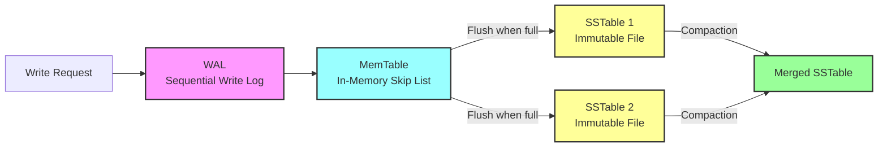

import { Aside, Card, CardGrid, Steps, Tabs, TabItem } from "@astrojs/starlight/components";

Understanding Log-Structured Merge Trees through FerrisDB's implementation.

**Difficulty:** 📙 Intermediate • **Reading time:** 25 minutes

## The Problem & Why It Matters

Have you ever wondered why your web application slows down when lots of users start writing data at
the same time? Or why some databases can handle millions of writes per second while others struggle
with thousands?

The problem lies in how traditional databases handle writes. Imagine you're managing a customer
database for an e-commerce site. Every time someone places an order, updates their profile, or adds
items to their cart, your database needs to write that information to disk.

**Traditional B-tree databases face a fundamental challenge:**

When you write data, the database has to:

1. Find the exact right spot on disk (like finding a specific page in a massive filing cabinet)
2. Read the entire page into memory
3. Modify just one small part
4. Write the entire page back to disk
5. Update multiple index pages

**Real-world analogy**: It's like having to find the exact right spot in a filing cabinet, pull out
the entire folder, add your single document, and put it back - for every single document. If the
cabinet is across the building (representing disk storage), this gets incredibly slow!

<Aside type="caution" title="Why this matters for CRUD developers">
  - **Slow write performance**: Your API endpoints that create/update data become bottlenecks -
  **Lock contention**: Multiple users trying to write at once wait in line - **Poor scalability**:
  Adding more users makes the problem exponentially worse
</Aside>

LSM-Trees solve this by completely rethinking how databases handle writes.

## Conceptual Overview

### The Core Idea

LSM-Trees (Log-Structured Merge Trees) solve the write performance problem with a simple but
revolutionary idea:

<Card title="Core LSM Principle" icon="information">
  "Instead of updating data in place, append all changes and merge them later"
</Card>

**Think of it like a restaurant's order system:**

1. **Taking orders** (writes): Waiters don't run to the kitchen after each order. They write orders
   on a notepad and collect multiple orders first
2. **Batching to kitchen** (flush): When the notepad is full, they give all orders to the kitchen at
   once
3. **Kitchen organization** (compaction): The kitchen organizes orders by table and cooking time for
   efficiency

This transforms expensive random writes (finding the exact spot) into fast sequential writes (just
append to the end).

### Visual Architecture



**Key principles:**

1. **Sequential writes**: Like writing in a journal - always append, never erase
2. **Memory buffering**: Collect writes in RAM before going to disk (like the notepad)
3. **Background merging**: Clean up and organize data when the system isn't busy

## FerrisDB Implementation Deep Dive

### Core Data Structures

Let's see how FerrisDB implements each component of the LSM-Tree:

```rust
// ferrisdb-storage/src/memtable/mod.rs:49-67
pub struct MemTable {
    /// Uses Arc for shared ownership in LSM-tree scenarios:
    /// - Storage engine keeps immutable MemTables for reads during flush
    /// - Background threads flush MemTable to SSTable
    /// - Iterators need concurrent access without blocking writes
    skiplist: Arc<SkipList>,
    memory_usage: AtomicUsize,
    max_size: usize,
}

impl MemTable {
    pub fn new(max_size: usize) -> Self {
        Self {
            skiplist: Arc::new(SkipList::new()),
            memory_usage: AtomicUsize::new(0),
            max_size,
        }
    }
}
```

**Key design decisions:**

1. **Skip List choice**: Provides O(log n) performance with lock-free reads (better than B-trees for
   concurrent access)
2. **Arc wrapping**: Allows safe sharing between read operations and background flush threads
3. **Memory tracking**: Knows when to flush to disk before running out of RAM

### Implementation Details

#### Component 1: MemTable - Fast In-Memory Writes

The MemTable is where all writes initially go - think of it as the "notepad" in our restaurant
analogy:

```rust
// ferrisdb-storage/src/memtable/mod.rs:81-95
pub fn put(&self, key: Key, value: Value, timestamp: Timestamp) -> Result<()> {
    let size_estimate = key.len() + value.len() + 64; // 64 bytes overhead estimate

    self.skiplist.insert(key, value, timestamp, Operation::Put);

    let new_usage = self
        .memory_usage
        .fetch_add(size_estimate, Ordering::Relaxed);

    if new_usage + size_estimate > self.max_size {
        return Err(Error::MemTableFull);
    }

    Ok(())
}
```

**How it works:**

1. **Immediate write**: Data goes straight into memory (like writing on the notepad)
2. **Size tracking**: Keeps track of how much memory is used
3. **Full detection**: Signals when it's time to "give orders to the kitchen" (flush to disk)

<Aside type="note" title="Why a Skip List?">
  - **O(log n) operations**: Finding items in a million-entry list takes only ~20 steps -
  **Lock-free reads**: Multiple threads can read without blocking each other - **Ordered
  iteration**: Essential for creating sorted files and range queries
</Aside>

#### Component 2: SSTables - Immutable Sorted Files

When the MemTable gets full, it's flushed to an SSTable (Sorted String Table):

```rust
// ferrisdb-storage/src/sstable/mod.rs:179-188
pub struct SSTableEntry {
    /// The internal key (user_key + timestamp)
    pub key: InternalKey,
    /// The value associated with this key version
    pub value: Value,
    /// The operation type (Put/Delete) for this entry
    pub operation: Operation,
}
```

**Performance characteristics:**

- **Time complexity**: O(log n) lookups using binary search within blocks
- **Space complexity**: Compressed storage on disk with block-based organization
- **I/O patterns**: Only reads necessary blocks, not entire files

## Performance Analysis

### Mathematical Analysis

<CardGrid>
  <Card title="Write Performance Improvement" icon="rocket">
    - **Traditional B-tree**: O(log n) random I/O operations per write
    - **LSM-Tree MemTable**: O(1) memory operation per write
    - **Improvement**: ~100x faster on traditional drives
  </Card>

  <Card title="Read Performance Trade-off" icon="magnifier">
    - **Best case** (in MemTable): O(log n) memory operation
    - **Worst case** (oldest SSTable): O(k × log n) where k = levels
    - **Range queries**: O(n) scan across sorted data
  </Card>
</CardGrid>

### Trade-off Analysis

<Tabs>
  <TabItem label="Advantages">
    - ✅ **Excellent write performance**: Sequential writes are much faster than random writes
    - ✅ **High write throughput**: Can batch multiple operations efficiently
    - ✅ **Good compression**: Sequential data on disk compresses well
    - ✅ **Crash recovery**: WAL ensures no data loss on system failures
  </TabItem>

<TabItem label="Disadvantages">
  - ⚠️ **Read amplification**: May need to check multiple SSTables for recent writes - ⚠️ **Write
  amplification**: Data gets written multiple times during compaction - ⚠️ **Space amplification**:
  Multiple versions of data exist until compaction
</TabItem>

  <TabItem label="When to use alternatives">
    - **Read-heavy workloads**: Consider B-tree databases if reads far exceed writes
    - **Small datasets**: Simple data structures might be more appropriate
    - **Strong consistency needs**: Some LSM implementations sacrifice consistency for performance
  </TabItem>
</Tabs>

## Advanced Topics

### Compaction Strategies

FerrisDB implements size-tiered compaction:

```rust
// ferrisdb-storage/src/storage_engine.rs (conceptual)
pub fn size_tiered_compaction(&mut self) -> Result<()> {
    // Group SSTables by similar size
    let mut size_tiers: BTreeMap<u64, Vec<SSTable>> = BTreeMap::new();

    for sstable in &self.sstables {
        let size_tier = size_tier_for_size(sstable.metadata.file_size);
        size_tiers.entry(size_tier).or_default().push(sstable.clone());
    }

    // Compact tiers with too many SSTables
    for (tier_size, sstables) in size_tiers {
        if sstables.len() >= self.config.max_sstables_per_tier {
            self.compact_sstables(sstables)?;
        }
    }

    Ok(())
}
```

**How compaction works:**

- **Background process**: Runs when system isn't busy serving requests
- **Merge operation**: Combines multiple sorted files into one larger sorted file
- **Garbage collection**: Removes outdated versions and deleted entries

### Future Improvements

<CardGrid>
  <Card title="Planned optimizations" icon="rocket">
    - **Leveled compaction**: More sophisticated merging strategy
    - **Bloom filters**: Skip reading SSTables that definitely don't contain a key
  </Card>

  <Card title="Research directions" icon="magnifier">
    - **Universal compaction**: Hybrid approach balancing read and write
    - **Partitioned compaction**: Parallel compaction for better utilization
  </Card>
</CardGrid>

## Hands-On Exploration

### Try It Yourself

<Tabs>
  <TabItem label="Exercise 1: Write Patterns">
    ```rust
    // Compare sequential vs random writes
    let mut memtable = MemTable::new(1024 * 1024);
    
    // Sequential writes (fast)
    for i in 0..1000 {
        let key = format!("key_{:06}", i);
        memtable.put(key.into_bytes(), b"value".to_vec(), i)?;
    }
    
    // Random writes (still fast in MemTable!)
    for i in 0..1000 {
        let key = format!("key_{:06}", rand::random::<u32>());
        memtable.put(key.into_bytes(), b"value".to_vec(), i)?;
    }
    ```
  </TabItem>
  
  <TabItem label="Exercise 2: Memory Usage">
    ```bash
    # Watch memory usage during bulk writes
    cargo run --example bulk_insert -- --count 100000 --observe-memory
    ```
  </TabItem>
</Tabs>

### Debugging & Observability

**Key metrics to watch:**

- **MemTable memory usage**: How close to flush threshold
- **SSTable count per level**: Indicates compaction health
- **Write amplification ratio**: How much extra work compaction is doing

**Debugging techniques:**

- **WAL inspection**: Use `cargo run --bin wal-reader` to examine write patterns
- **SSTable analysis**: Check key distributions and overlaps between files

## Real-World Context

### Industry Comparison

How other databases handle this:

| Database        | Compaction Strategy         | Key Feature             |
| --------------- | --------------------------- | ----------------------- |
| Cassandra       | Size-tiered (like FerrisDB) | Wide column support     |
| LevelDB/RocksDB | Leveled compaction          | Better read performance |
| ScyllaDB        | Per-core LSM trees          | Better parallelism      |

### Historical Evolution

<Steps>

1. **1996**: Log-Structured File System paper introduces core concepts
2. **2006**: Google's BigTable popularizes LSM-trees for large-scale systems
3. **2011**: LevelDB makes LSM-trees accessible to application developers
4. **2023**: Modern implementations focus on NVMe optimization and cloud storage

</Steps>

## Common Pitfalls & Best Practices

### Implementation Pitfalls

<Aside type="danger" title="Pitfall 1: Forgetting WAL durability">
  **Problem**: Losing data on crash because WAL isn't synced to disk **Solution**: Always call
  `fsync()` on WAL before acknowledging writes
</Aside>

<Aside type="danger" title="Pitfall 2: Poor compaction scheduling">
  **Problem**: Running compaction during peak traffic **Solution**: Monitor write patterns and
  schedule compaction during low-traffic periods
</Aside>

### Production Considerations

**Operational concerns:**

- **Disk space monitoring**: LSM-trees can temporarily use 2x space during compaction
- **Compaction throttling**: Avoid overloading I/O during peak hours
- **Backup strategies**: Consider SSTable-level backups for faster recovery

## Summary & Key Takeaways

### Core Concepts Learned

1. **Sequential writes are much faster than random writes**: LSM-trees exploit this by deferring
   organization
2. **Memory buffering enables write batching**: MemTables collect writes before expensive disk
   operations
3. **Background compaction trades write amplification for read performance**: System does extra work
   later to maintain good read speeds

### When to Apply This Knowledge

- **Use LSM-trees when**: Your application has write-heavy workloads (logging, analytics,
  time-series data)
- **Consider alternatives when**: Read performance is more critical than write performance
- **Implementation complexity**: Moderate - requires careful coordination between components

## Further Reading & References

### Related FerrisDB Articles

- [Understanding WAL and Crash Recovery](/concepts/database-internals/wal/) - How durability works
  in LSM systems
- [SSTable Format Design](/concepts/database-internals/sstables/) - Deep dive into persistent
  storage
- [Lock-Free Skip Lists](/concepts/database-internals/skip-lists/) - MemTable implementation details

### Academic Papers

- "The Log-Structured Merge-Tree" (O'Neil et al., 1996) - Original LSM-tree paper
- "Bigtable: A Distributed Storage System for Structured Data" (Chang et al., 2008) - Google's LSM
  implementation

### Industry Resources

- [RocksDB Wiki](https://github.com/facebook/rocksdb/wiki) - Extensive documentation on LSM
  optimizations
- [Cassandra Documentation](https://cassandra.apache.org/doc/) - Production LSM-tree system

### FerrisDB Code Exploration

- **Primary implementation**: `ferrisdb-storage/src/` - Complete LSM-tree implementation
- **MemTable**: `ferrisdb-storage/src/memtable/mod.rs` - In-memory buffer
- **SSTable**: `ferrisdb-storage/src/sstable/` - Persistent storage format
- **Tests**: `ferrisdb-storage/src/storage_engine.rs` - Integration test examples

---

_Part of the [FerrisDB Learning Journey](/). Built with ❤️ by a human and an AI._
