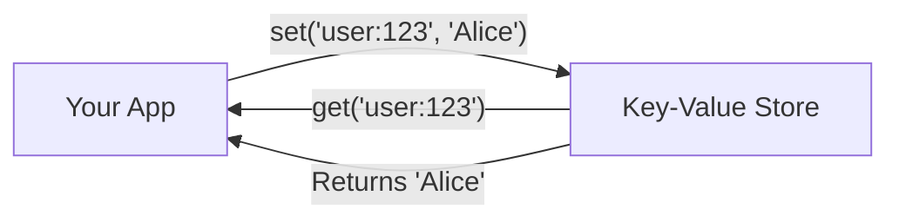

import { Tabs, TabItem, Aside, Steps, Card, CardGrid, Badge } from "@astrojs/starlight/components";

## What We're Building Today

Today we're building the foundation of FerrisDB - a simple key-value store! Think of it like a
super-fast notebook where you can store and retrieve information using a unique key.



### The Real-World Problem

Every web app needs fast data access. When someone visits your e-commerce site:

- You need their shopping cart (key: `cart:user123`)
- You need their session (key: `session:abc123`)
- You need product details (key: `product:789`)

Redis solves this problem. Today, we'll build our own version!

### What You'll Learn

<CardGrid>
  <Card title="🦀 New Rust Concepts" icon="code">
    - **Variables**: How Rust handles data
    - **Mutability**: When data can change
    - **Structs**: Creating custom types
    - **HashMap**: Rust's key-value collection
    - **Option**: Handling missing values
  </Card>

  <Card title="📚 Database Knowledge" icon="database">
    - **Key-Value Model**: Simplest database design
    - **In-Memory Storage**: Trading durability for speed
    - **Hash Tables**: O(1) performance magic
  </Card>
</CardGrid>

## Prerequisites

<Card title="Before You Start" icon="information">

**Required**:

- Rust installed ([rustup.rs](https://rustup.rs))
- Basic programming knowledge (any language)
- A text editor

**Time Needed**: ~30 minutes

**No Prior Rust Knowledge Required!** 🎉

</Card>

## Setup

Let's create our workspace:

```bash
# Create a new Rust project
cargo new --lib tutorial-01-kv-store
cd tutorial-01-kv-store

# Open in your editor
code . # or your preferred editor
```

## Let's Build!

### Step 1: Creating Our Storage Structure

Let's start with the simplest possible key-value store:

<Tabs>
  <TabItem label="Write This Code">

    ```rust
    // In src/lib.rs
    // A struct is like a class in other languages
    pub struct KeyValueStore {
        // For now, we'll add fields in the next step
    }
    ```

  </TabItem>

<TabItem label="Understanding the Code">

```rust
pub struct KeyValueStore {
//│  │     └─ The name of our type
//│  └─ Keyword to define a new type
//└─ "public" - other code can use this
}
```

</TabItem>

<TabItem label="If You Know JavaScript">

```javascript
// In JavaScript, you might write:
class KeyValueStore {
  // fields go here
}

// Or with modern JS:
const KeyValueStore = class {
  // implementation
};
```

**Key differences**:

- Rust uses `struct` instead of `class`
- `pub` makes it public (like `export`)
- No inheritance in Rust (we'll use traits later)

</TabItem>

  <TabItem label="If You Know Python">

    ```python
    # In Python, you might write:
    class KeyValueStore:
        def __init__(self):
            # Initialize here
            pass
    ```

    **Key differences**:
    - Rust separates data (`struct`) from methods (`impl`)
    - No `self` in the struct definition
    - Types are defined at compile time

  </TabItem>
</Tabs>

<Aside type="note" title="🦀 New Rust Concept: Structs">

A **struct** is Rust's way of creating custom types. Think of it like:

- A class without inheritance (Java/C#)
- An object literal with a fixed shape (JavaScript)
- A dataclass (Python)

**Why structs?** They group related data together with guaranteed memory layout.

📖 **Learn more**:
[The Rust Book - Structs](https://doc.rust-lang.org/book/ch05-01-defining-structs.html)

</Aside>

### Step 2: Adding Storage with HashMap

Now let's add actual storage to our struct:

<Tabs>
  <TabItem label="Evolve Our Code">

    ```rust
    use std::collections::HashMap;

    pub struct KeyValueStore {
        // HashMap is like Map in JS or dict in Python
        data: HashMap<String, String>,
    }
    ```

  </TabItem>
  
  <TabItem label="What Changed">

    ```diff
    + use std::collections::HashMap;

    pub struct KeyValueStore {
    +     data: HashMap<String, String>,
    }
    ```

    We added:
    - `use` statement to import HashMap
    - A field called `data` that stores String keys and String values

  </TabItem>
</Tabs>

<Aside type="note" title="📚 Database Concept: Hash Tables">

**Hash tables** provide O(1) average-case lookups - that means finding a value is equally fast
whether you have 10 items or 10 million!

Real databases like Redis use hash tables for:

- Session storage
- Caching
- Counters
- Any key-value data

**Trade-off**: No ordering, uses more memory than arrays.

</Aside>

### Step 3: Creating New Instances

Let's add a way to create new key-value stores:

<Tabs>
  <TabItem label="Add This Code">

    ```rust
    impl KeyValueStore {
        // This is like a constructor
        pub fn new() -> Self {
            KeyValueStore {
                data: HashMap::new(),
            }
        }
    }
    ```

  </TabItem>
  
  <TabItem label="Understanding impl Blocks">

    ```rust
    impl KeyValueStore {
    //│  └─ The type we're adding methods to
    //└─ "implementation" - where methods live

        pub fn new() -> Self {
        //     │   │    └─ Returns our type
        //     │   └─ No parameters
        //     └─ Function name (convention: "new")

            KeyValueStore {
                data: HashMap::new(),
            }
        }
    }
    ```

  </TabItem>
</Tabs>

#### Test What We Built

```rust
#[cfg(test)]
mod tests {
    use super::*;

    #[test]
    fn new_creates_empty_store() {
        let store = KeyValueStore::new();
        assert!(store.is_empty());
        assert_eq!(store.len(), 0);
    }
}
```

Run it:

```bash
cargo test new_creates_empty_store
```

<Aside type="tip" title="What This Test Proves">
  This test verifies our constructor creates an empty store. The `assert!` macro checks boolean
  conditions, while `assert_eq!` compares values for equality. This proves our basic structure
  works!
</Aside>

### Step 4: Storing Values

Now for the core functionality - storing key-value pairs:

<Tabs>
  <TabItem label="Add set() Method">

    ```rust
    impl KeyValueStore {
        pub fn new() -> Self {
            KeyValueStore {
                data: HashMap::new(),
            }
        }

        // Add this method
        pub fn set(&mut self, key: String, value: String) {
            self.data.insert(key, value);
        }
    }
    ```

  </TabItem>
  
  <TabItem label="Understanding Mutability">

    ```rust
    pub fn set(&mut self, key: String, value: String) {
    //         │    │
    //         │    └─ "mutable borrow of self"
    //         └─ We need to modify the struct

        self.data.insert(key, value);
        //        │      └─ HashMap's insert method
        //        └─ Adds or updates the key
    }
    ```

  </TabItem>
</Tabs>

<Aside type="note" title="🦀 New Rust Concept: Mutability with &mut">

In Rust, data is **immutable by default**. To modify something, you need to:

1. Declare it with `mut` (for variables)
2. Use `&mut` (for references)

**Think of it like**:

- `&self` = "I want to read this"
- `&mut self` = "I want to read AND write this"

This prevents accidental modifications and data races!

📖 **Learn more**:
[The Rust Book - References and Borrowing](https://doc.rust-lang.org/book/ch04-02-references-and-borrowing.html)

</Aside>

### Step 5: Retrieving Values

Let's add the ability to get values back:

<Tabs>
  <TabItem label="Add get() Method">

    ```rust
    impl KeyValueStore {
        // ... new() and set() methods ...

        pub fn get(&self, key: &str) -> Option<String> {
            self.data.get(key).cloned()
        }
    }
    ```

  </TabItem>
  
  <TabItem label="Understanding Option">

    ```rust
    pub fn get(&self, key: &str) -> Option<String> {
    //         │     │            └─ Might return a String
    //         │     └─ Borrow the key (don't take ownership)
    //         └─ Only need to read

        self.data.get(key).cloned()
        //        │       └─ Make a copy of the value
        //        └─ Returns Option<&String>
    }
    ```

  </TabItem>
  
  <TabItem label="If You Know JavaScript">

    ```javascript
    // JavaScript returns undefined for missing keys
    const value = map.get("key"); // undefined or value

    // Rust returns Option<T>
    let value = store.get("key"); // Some(value) or None
    ```

    Option is Rust's null-safe way of handling missing values!

  </TabItem>
</Tabs>

<Aside type="note" title="🦀 New Rust Concept: Option&lt;T&gt;">

`Option<T>` is Rust's way of handling nullable values safely:

- `Some(value)` - We have a value
- `None` - No value exists

**No more null pointer exceptions!** The compiler forces you to handle both cases.

📖 **Learn more**:
[The Rust Book - Option](https://doc.rust-lang.org/book/ch06-01-defining-an-enum.html#the-option-enum-and-its-advantages-over-null-values)

</Aside>

### Step 6: Adding Utility Methods

Let's add some helpful methods to check the store's state:

<Tabs>
  <TabItem label="Add len() and is_empty()">

    ```rust
    impl KeyValueStore {
        // ... previous methods ...

        pub fn len(&self) -> usize {
            self.data.len()
        }

        pub fn is_empty(&self) -> bool {
            self.data.is_empty()
        }
    }
    ```

  </TabItem>
  
  <TabItem label="Why These Methods?">

    These utility methods follow Rust conventions:

    - `len()` - Returns the number of entries (like Vec, HashMap, etc.)
    - `is_empty()` - More readable than `len() == 0`

    **Database insight**: Real databases track metrics like entry count for performance monitoring!

  </TabItem>
</Tabs>

### Step 7: Complete Working Example

Let's put it all together with a comprehensive test:

```rust
#[cfg(test)]
mod tests {
    use super::*;

    #[test]
    fn set_stores_value_and_get_retrieves_it() {
        let mut store = KeyValueStore::new();

        // Test basic set and get
        store.set("user:1".to_string(), "Alice".to_string());
        assert_eq!(store.get("user:1"), Some("Alice".to_string()));

        // Test missing key
        assert_eq!(store.get("user:2"), None);

        // Test overwrite
        store.set("user:1".to_string(), "Alice Smith".to_string());
        assert_eq!(store.get("user:1"), Some("Alice Smith".to_string()));
    }
}
```

Run all tests:

```bash
cargo test
```

<Aside type="tip" title="What This Test Teaches">
This comprehensive test demonstrates three key concepts:

1. **Happy path**: Basic set/get functionality works
2. **Option&lt;T&gt; handling**: Missing keys return `None` (not crashes!)
3. **Update behavior**: Setting the same key twice updates the value

This is exactly how real databases like Redis work!

</Aside>

### Step 8: Trying It Out

Let's see our key-value store in action outside of tests:

```rust
// Create a new file: src/main.rs
use tutorial_01_kv_store::KeyValueStore;

fn main() {
    let mut store = KeyValueStore::new();

    // Store some user data
    store.set("user:1".to_string(), "Alice".to_string());
    store.set("user:2".to_string(), "Bob".to_string());

    // Retrieve and display
    println!("Looking up users...");

    match store.get("user:1") {
        Some(name) => println!("User 1: {}", name),
        None => println!("User 1 not found"),
    }

    // Try a missing key
    match store.get("user:999") {
        Some(name) => println!("User 999: {}", name),
        None => println!("User 999 not found"),
    }
}
```

Run it:

```bash
cargo run
```

You should see:

```
Looking up users...
User 1: Alice
User 999 not found
```

### Step 9: Making It Clippy-Compliant

Rust has a helpful tool called `clippy` that suggests improvements. Let's follow one of its recommendations:

<Tabs>
  <TabItem label="Add Default Implementation">

    ```rust
    use std::collections::HashMap;

    #[derive(Default)]  // Add this line
    pub struct KeyValueStore {
        data: HashMap<String, String>,
    }
    ```

    This automatically implements the `Default` trait, which provides a standard way to create an empty store.

  </TabItem>
  
  <TabItem label="Why This Matters">

    ```rust
    // With Default, users can now do:
    let store = KeyValueStore::default();

    // In addition to:
    let store = KeyValueStore::new();
    ```

    It's a Rust convention: if your type has an obvious "empty" or "default" state, implement Default!

    **Bonus**: This satisfies Rust's linter (clippy) and makes your code more idiomatic.

  </TabItem>
</Tabs>

<Aside type="tip" title="Running Clippy">
  You can check your code with clippy anytime: ```bash cargo clippy ``` It's like having a Rust
  expert review your code!
</Aside>

### Comparing with Real FerrisDB

<Tabs>
  <TabItem label="Our Tutorial Code">

    ```rust
    use std::collections::HashMap;

    #[derive(Default)]
    pub struct KeyValueStore {
        data: HashMap<String, String>,
    }

    impl KeyValueStore {
        pub fn new() -> Self {
            KeyValueStore {
                data: HashMap::new(),
            }
        }

        pub fn set(&mut self, key: String, value: String) {
            self.data.insert(key, value);
        }

        pub fn get(&self, key: &str) -> Option<String> {
            self.data.get(key).cloned()
        }

        pub fn len(&self) -> usize {
            self.data.len()
        }

        pub fn is_empty(&self) -> bool {
            self.data.is_empty()
        }
    }
    ```

  </TabItem>
  
  <TabItem label="Real FerrisDB Approach">

    ```rust
    // Simplified from ferrisdb-storage/src/memtable/mod.rs
    pub struct MemTable {
        skiplist: Arc<SkipList>,
        memory_usage: AtomicUsize,
        max_size: usize,
    }

    impl MemTable {
        pub fn set(&self, key: Vec<u8>, value: Vec<u8>) -> Result<()> {
            // Uses bytes for flexibility
            // Tracks memory usage
            // Returns Result for error handling
            // Uses skip list for ordering
        }
    }
    ```

  </TabItem>
  
  <TabItem label="Key Differences">

    Real FerrisDB adds:

    - **Bytes instead of Strings**: More flexible
    - **Skip List instead of HashMap**: Maintains order
    - **Memory tracking**: Knows when to flush
    - **Error handling**: Production robustness
    - **Concurrency**: Thread-safe operations

    We'll build toward these features in future tutorials!

  </TabItem>
</Tabs>

## 🎉 Congratulations!

You've successfully built your first database component in Rust!

### What You Built

- ✅ A working key-value store (like a mini Redis)
- ✅ Set and get operations
- ✅ Proper handling of missing keys
- ✅ Utility methods for counting and checking emptiness
- ✅ Your first Rust struct and methods

### Rust Concepts You Mastered

- 🦀 **Structs**: Creating custom types
- 🦀 **Mutability**: Understanding `&mut self` vs `&self`
- 🦀 **HashMap**: Using Rust's built-in collections
- 🦀 **Option&lt;T&gt;**: Safe handling of nullable values
- 🦀 **Methods**: Adding behavior with `impl` blocks

### Database Knowledge You Gained

- 📚 **Key-Value Model**: The simplest database abstraction
- 📚 **Hash Tables**: O(1) performance for lookups
- 📚 **In-Memory Storage**: Speed vs durability trade-off

## Next Steps

<CardGrid>
  <Card title="You Found Our Secret! 🤫" icon="puzzle">
    Tutorial 2 is still in stealth mode. We're adding the final touches! Drop us a star if you want
    us to hurry up! ⭐
  </Card>

  <Card title="Practice Challenges" icon="puzzle">
    1. Add a `delete()` method 2. Add a `len()` method to count entries 3. Make keys
    case-insensitive
  </Card>
</CardGrid>

## Quick Reference

### Commands We Used

```bash
cargo new --lib tutorial-01-kv-store
cargo test
cargo test test_specific_name
```

### Key Patterns

```rust
// Creating a struct
pub struct Name { field: Type }

// Adding methods
impl Name {
    pub fn method(&self) { }     // read-only
    pub fn method(&mut self) { } // read-write
}

// Using Option
match result {
    Some(value) => // use value,
    None => // handle missing,
}
```

---

<Aside type="note" title="📝 How was this tutorial?">
  We're constantly improving! If anything was confusing, please let us know. Our goal is to make
  database internals accessible to every developer.
</Aside>

**Great job! You've mastered the basics of Rust and built your first database component!** 🚀
