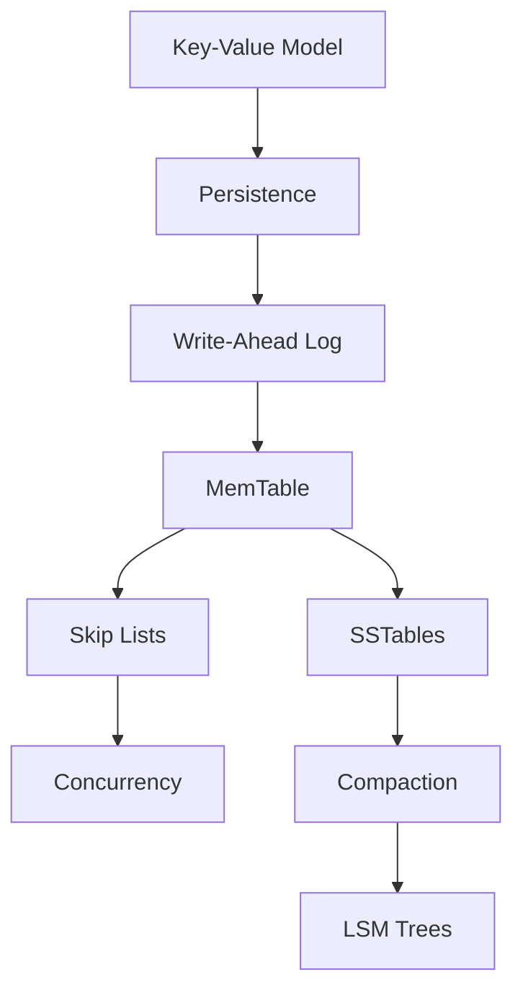

# Database Concepts Teaching Tracker

_Source of truth for what database concepts have been taught in FerrisDB tutorials_

**Purpose**: Track which database concepts have been introduced to build knowledge systematically and avoid assumption gaps.

## Concept Categories

### 💾 Storage Fundamentals

#### Data Organization

- [ ] Key-value model
- [ ] Row-based vs columnar storage
- [ ] In-memory vs persistent storage
- [ ] Pages and blocks
- [ ] Record layout

#### Persistence

- [ ] Volatile vs non-volatile storage
- [ ] Serialization/deserialization
- [ ] File formats (text vs binary)
- [ ] Checksums and data integrity
- [ ] Storage hierarchy (memory → disk)

### 🛡️ Durability & Recovery

#### Write-Ahead Logging

- [ ] What is a WAL
- [ ] Why sequential writes are fast
- [ ] Log-structured storage
- [ ] Recovery process
- [ ] Checkpoint mechanisms

#### Crash Recovery

- [ ] ACID properties overview
- [ ] Durability guarantees
- [ ] Fsync and OS buffers
- [ ] Recovery time objectives
- [ ] Idempotent operations

### 🌳 Data Structures

#### Tree Structures

- [ ] Binary search trees (BST)
- [ ] B-trees and B+ trees
- [ ] LSM trees
- [ ] Trade-offs between structures
- [ ] Height-balanced trees

#### Skip Lists

- [ ] Probabilistic data structures
- [ ] Skip list vs B-tree
- [ ] Concurrent skip lists
- [ ] Memory efficiency
- [ ] Cache performance

#### Hash Tables

- [ ] Hash functions
- [ ] Collision resolution
- [ ] Load factors
- [ ] Hash indexes
- [ ] Distributed hashing

### 📊 Storage Engine Design

#### MemTable Design

- [ ] Write buffers
- [ ] Memory pressure
- [ ] Flush triggers
- [ ] Write amplification
- [ ] Read/write trade-offs

#### SSTable Format

- [ ] Sorted String Tables
- [ ] Block structure
- [ ] Index design
- [ ] Compression benefits
- [ ] Bloom filters purpose

#### Compaction

- [ ] Why compaction is needed
- [ ] Size-tiered compaction
- [ ] Leveled compaction
- [ ] Write amplification
- [ ] Space amplification

### 🔄 Concurrency & Transactions

#### Concurrency Control

- [ ] Race conditions
- [ ] Locks (shared/exclusive)
- [ ] Lock-free data structures
- [ ] MVCC basics
- [ ] Optimistic vs pessimistic

#### Transaction Concepts

- [ ] ACID properties
- [ ] Isolation levels
- [ ] Transaction logs
- [ ] Two-phase commit
- [ ] Distributed transactions

### 🚀 Performance & Optimization

#### Caching

- [ ] Buffer pools
- [ ] Page cache
- [ ] Block cache
- [ ] Cache eviction policies
- [ ] Hot/cold data

#### Indexing

- [ ] Primary vs secondary indexes
- [ ] Covering indexes
- [ ] Index maintenance cost
- [ ] Index selection
- [ ] Composite indexes

#### Query Processing

- [ ] Point queries
- [ ] Range scans
- [ ] Query planning basics
- [ ] Cost-based optimization
- [ ] Statistics and cardinality

### 🌐 Distributed Concepts

#### Replication

- [ ] Primary-replica model
- [ ] Synchronous vs asynchronous
- [ ] Consistency models
- [ ] Conflict resolution
- [ ] Quorum systems

#### Sharding

- [ ] Horizontal partitioning
- [ ] Shard keys
- [ ] Routing strategies
- [ ] Rebalancing
- [ ] Hot spots

## 📚 Concepts by Tutorial

### Tutorial 1: Building a Simple Key-Value Store

_Status: PUBLISHED_

**Introduced**:

- ✅ Key-value model - Simplest database abstraction
- ✅ In-memory storage - Why databases cache data
- ✅ Hash table basics - O(1) average access time

**File**: `/docs/src/content/docs/tutorials/01-key-value-store.mdx`

### Tutorial 2: Adding Persistence

_Status: [PLANNED]_

**Introduced**:

- [ ] Volatile vs non-volatile storage - RAM vs disk
- [ ] Serialization - Converting memory structures to bytes
- [ ] File formats - Why binary is more efficient than JSON

**Reinforced**:

- [ ] Key-value model - Now with persistence

**File**: `tutorials/02-persistence.mdx`

### Tutorial 3: Write-Ahead Log

_Status: [PLANNED]_

**Introduced**:

- [ ] Write-Ahead Logging - Durability before performance
- [ ] Sequential writes - Why they're 100x faster than random
- [ ] Crash recovery - How databases survive power loss
- [ ] Fsync importance - When data is really on disk

**Reinforced**:

- [ ] Durability guarantees
- [ ] Binary file handling

**File**: `tutorials/03-write-ahead-log.mdx`

### Tutorial 4: Building a MemTable

_Status: [PLANNED]_

**Introduced**:

- [ ] Write buffers - Batching for performance
- [ ] Memory pressure - When to flush to disk
- [ ] Skip lists - Concurrent sorted storage
- [ ] Read/write trade-offs - Optimizing for writes

**Reinforced**:

- [ ] In-memory storage patterns
- [ ] Data structure selection

**File**: `tutorials/04-memtable.mdx`

## 🔄 Maintenance Instructions

### When Writing a New Tutorial

1. **Before starting**: Review which concepts are already taught
2. **Plan concepts**: Choose 2-4 database concepts that build on previous knowledge
3. **During writing**:
   - Introduce concepts with real-world analogies
   - Explain WHY before HOW
   - Show impact with concrete examples
4. **After completion**: Update this tracker

### Format for Updates

```markdown
### Tutorial N: [Title]

_Status: [PLANNED|DRAFT|PUBLISHED]_

**Introduced**:

- ✅ Concept name - Real-world impact explained
- ✅ Another concept - Why it matters for CRUD apps

**Reinforced**:

- ✅ Previous concept (from Tutorial X) - New context

**File**: `tutorials/NN-tutorial-name.mdx`
```

## 📊 Concept Dependency Graph



## 🎯 Teaching Philosophy

### Make It Relatable

- **Web App Analogies**: "Like Redis but we build it"
- **Real Problems**: "What happens when the server crashes?"
- **Concrete Examples**: "An e-commerce order that must not be lost"

### Build Understanding Gradually

1. **Start Simple**: Key-value is just a HashMap
2. **Add Complexity**: What if power fails?
3. **Introduce Trade-offs**: Fast writes vs fast reads
4. **Show Solutions**: How real databases solve this

### Connect to CRUD Experience

- "You know database transactions from Rails/Django"
- "Like database migrations but for storage format"
- "Similar to Redis caching but persistent"

## 📈 Quick Reference Matrix

| Concept                              | Tutorial First Introduced | Real-World Example    |
| ------------------------------------ | ------------------------- | --------------------- |
| Key-Value Model                      | Tutorial 1                | Redis, DynamoDB       |
| Persistence                          | Tutorial 2                | PostgreSQL data files |
| WAL                                  | Tutorial 3                | MySQL binary log      |
| Skip Lists                           | Tutorial 4                | Redis sorted sets     |
| _...add as tutorials are created..._ |                           |                       |

## 🚀 End Goal

By the end of all tutorials, a CRUD developer should understand:

- ✅ Why databases make specific design choices
- ✅ Trade-offs between performance and durability
- ✅ How modern storage engines work internally
- ✅ When to use different database types
- ✅ How to debug database performance issues
