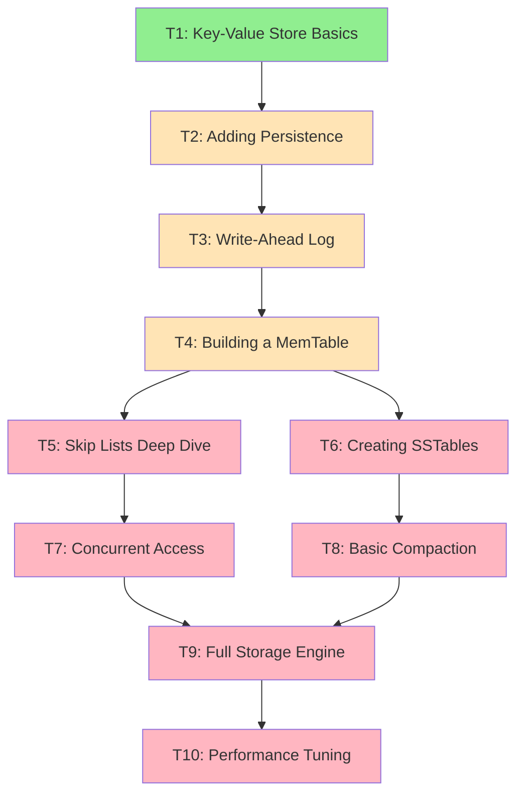

# FerrisDB Tutorial Learning Progress Dashboard

_Central dashboard for tracking tutorial progress and concept coverage_

## 🎯 Tutorial Series Overview

**Goal**: Teach CRUD developers to build a complete storage engine from scratch, introducing Rust and database concepts gradually.

**Teaching Philosophy**:

- 🏗️ One component at a time
- 🦀 One new Rust concept per step
- 📚 Connect to real-world database problems
- 🧪 Test everything as we go
- 🎉 Celebrate progress

## 📊 Tutorial Dependency Graph

**Legend**:

- 🟢 Published
- 🟡 In Progress/Draft
- 🔴 Planned

## 📚 Curriculum Overview

### Phase 1: Foundation (Tutorials 1-3)

_Learn basic Rust and storage concepts_

| Tutorial            | Status       | Rust Concepts                                 | Database Concepts                     | Estimated Time |
| ------------------- | ------------ | --------------------------------------------- | ------------------------------------- | -------------- |
| T1: Key-Value Store | 🟢 Published | `let`, `mut`, structs, `HashMap`, `Option<T>` | Key-value model, in-memory storage    | 30 min         |
| T2: Persistence     | 🔴 Planned   | `Result<T,E>`, `?`, file I/O, external crates | Serialization, volatile vs persistent | 30 min         |
| T3: Write-Ahead Log | 🔴 Planned   | Custom errors, `From` trait, binary files     | WAL, durability, crash recovery       | 45 min         |

### Phase 2: Core Components (Tutorials 4-8)

_Build real database components_

| Tutorial        | Status     | Rust Concepts                        | Database Concepts                     | Estimated Time |
| --------------- | ---------- | ------------------------------------ | ------------------------------------- | -------------- |
| T4: MemTable    | 🔴 Planned | `Arc<T>`, `RwLock<T>`, traits        | Write buffers, memory pressure        | 45 min         |
| T5: Skip Lists  | 🔴 Planned | Generics, `Box<T>`, unsafe basics    | Probabilistic structures, concurrency | 60 min         |
| T6: SSTables    | 🔴 Planned | Binary encoding, builders, iterators | Sorted storage, block format          | 45 min         |
| T7: Concurrency | 🔴 Planned | Threads, `Send`/`Sync`, atomics      | Lock-free reads, concurrent writes    | 60 min         |
| T8: Compaction  | 🔴 Planned | Async basics, channels               | Merge strategies, write amplification | 45 min         |

### Phase 3: Integration (Tutorials 9-10)

_Put it all together_

| Tutorial           | Status     | Rust Concepts             | Database Concepts                       | Estimated Time |
| ------------------ | ---------- | ------------------------- | --------------------------------------- | -------------- |
| T9: Storage Engine | 🔴 Planned | Module system, API design | LSM architecture, component integration | 60 min         |
| T10: Performance   | 🔴 Planned | Benchmarking, profiling   | Optimization, trade-offs                | 45 min         |

## 🎓 Concept Coverage Matrix

### Rust Concepts Progress

| Category           | Concepts                    | Coverage       |
| ------------------ | --------------------------- | -------------- |
| **Basics**         | Variables, types, functions | 🟩⬜⬜⬜⬜ 20% |
| **Ownership**      | Move, borrow, lifetimes     | 🟩⬜⬜⬜⬜ 20% |
| **Error Handling** | Result, ?, custom errors    | ⬜⬜⬜⬜⬜ 0%  |
| **Collections**    | Vec, HashMap, iterators     | 🟩⬜⬜⬜⬜ 20% |
| **Concurrency**    | Arc, Mutex, threads         | ⬜⬜⬜⬜⬜ 0%  |
| **Advanced**       | Traits, generics, unsafe    | ⬜⬜⬜⬜⬜ 0%  |

### Database Concepts Progress

| Category        | Concepts                      | Coverage       |
| --------------- | ----------------------------- | -------------- |
| **Storage**     | KV model, persistence, files  | 🟩⬜⬜⬜⬜ 20% |
| **Durability**  | WAL, recovery, fsync          | ⬜⬜⬜⬜⬜ 0%  |
| **Memory**      | Buffers, caching, pressure    | 🟩⬜⬜⬜⬜ 20% |
| **Structures**  | Trees, skip lists, hashing    | 🟩⬜⬜⬜⬜ 20% |
| **Concurrency** | Locks, MVCC, atomicity        | ⬜⬜⬜⬜⬜ 0%  |
| **Performance** | Compaction, caching, indexing | ⬜⬜⬜⬜⬜ 0%  |

## 📈 Learning Outcomes

By the end of the tutorial series, learners will:

### Can Build

- ✅ Complete key-value storage engine
- ✅ Write-ahead log for durability
- ✅ Concurrent in-memory storage
- ✅ Persistent SSTable format
- ✅ Basic compaction strategy
- ✅ Full LSM-tree implementation

### Understands

- ✅ Why databases make specific trade-offs
- ✅ How durability is guaranteed
- ✅ When to use different data structures
- ✅ Performance implications of design choices
- ✅ Concurrency patterns in databases

### Can Apply

- ✅ Rust ownership to prevent bugs
- ✅ Error handling for robustness
- ✅ Concurrent programming safely
- ✅ Performance analysis techniques
- ✅ System design principles

## 🔧 Tutorial Creation Checklist

When creating a new tutorial:

- [ ] Review concept trackers for prerequisites
- [ ] Update RUST-CONCEPTS-TAUGHT.md
- [ ] Update DATABASE-CONCEPTS-TAUGHT.md
- [ ] Update this progress dashboard
- [ ] Test all code against real FerrisDB
- [ ] Verify language comparisons are fair
- [ ] Get feedback from CRUD developer
- [ ] Update dependency graph if needed

## 📊 Success Metrics

### Engagement Metrics

- Tutorial completion rate: _TBD_
- Average time per tutorial: _TBD_
- Concept quiz success rate: _TBD_
- GitHub stars from tutorials: _TBD_

### Learning Metrics

- Concepts successfully taught: 0/50
- Code exercises completed: _TBD_
- Community questions quality: _TBD_
- Follow-up projects created: _TBD_

## 🚀 Next Steps

1. **Create Tutorial 1**: Key-Value Store Basics
2. **Test with CRUD developers**: Get early feedback
3. **Refine template**: Based on learnings
4. **Build momentum**: Regular tutorial releases

---

_This dashboard is the source of truth for tutorial planning and progress tracking._
