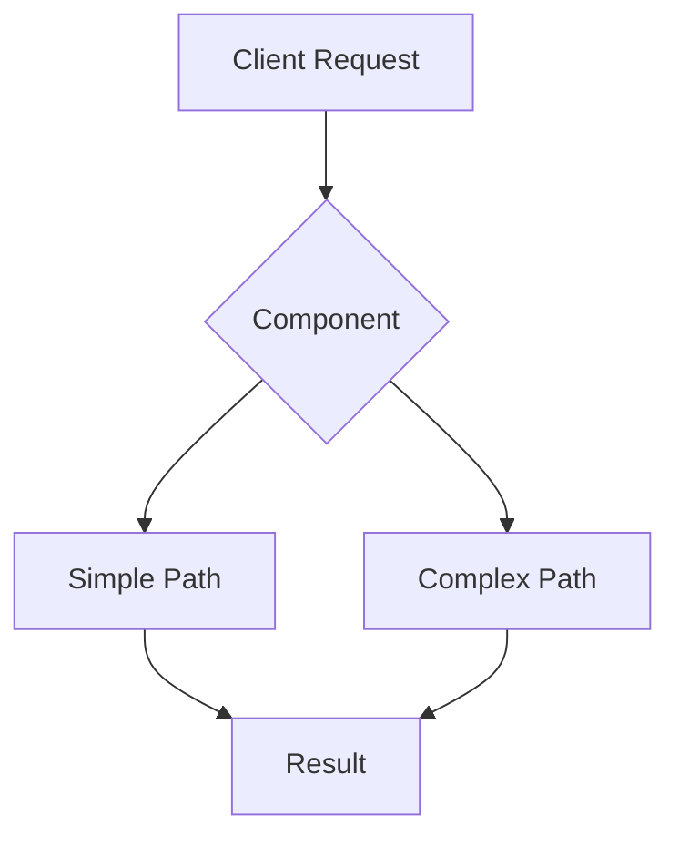

<!--
DATABASE CONCEPT TEMPLATE - Starlight Format

Design Philosophy Alignment:
- Simplicity First: Start with simple implementation, add complexity only when needed
- Show Don't Tell: Working code before theory
- Developer-Skeptical: Provide immediate verification paths
- Honest Limitations: Clear about what's not implemented yet

TARGET: CRUD developers learning database internals
GOAL: Make complex concepts accessible through FerrisDB implementation
-->

import { Card, CardGrid, Tabs, TabItem, Aside, Steps, Badge } from "@astrojs/starlight/components";

[One-paragraph hook explaining why a CRUD developer should care about this concept]

<CardGrid>
  <Card title="📗 Difficulty" icon="open-book">
    **[Beginner|Intermediate|Advanced]**
  </Card>

<Card title="⏱️ Reading Time" icon="clock">
  **[X] minutes**
</Card>

  <Card title="🎯 You'll Learn" icon="rocket">
    [Main practical outcome]
  </Card>
</CardGrid>

## See It Working First

<Tabs>
  <TabItem label="Simple Example">
    ```rust
    // Try this in FerrisDB
    use ferrisdb_storage::[Component];
    
    // Simplest possible usage
    let component = [Component]::new();
    component.operation()?;
    ```
  </TabItem>
  
  <TabItem label="What's Happening">
    ```rust
    // ferrisdb-storage/src/[component]/[file].rs:[lines]
    // The actual implementation - notice how simple it is
    impl [Component] {
        pub fn operation(&self) -> Result<()> {
            // Key insight: [explain core concept]
        }
    }
    ```
  </TabItem>
  
  <TabItem label="Verify It Works">
    ```bash
    # Run the actual test
    cargo test [component]_basics
    
    # See it in action
    cargo run --example [component]_demo
    ```
  </TabItem>
</Tabs>

## The Problem This Solves

<Aside type="note" title="Real-World Impact">
  Without [this concept], your database would [specific bad outcome]. This is why
  [PostgreSQL/MySQL/Redis] spends significant effort on this.
</Aside>

**Concrete scenarios**:

- 🐌 **Performance**: [Specific metric without this optimization]
- 💥 **Reliability**: [What fails without this]
- 📈 **Scalability**: [Limitation this removes]

## Core Concept Explained Simply

### The Analogy

[Use everyday analogy - restaurant, library, post office, etc.]

### In Database Terms



<Aside type="tip">The key insight: [Core concept in one sentence]</Aside>

## FerrisDB's Implementation

### Design Decision: Simplicity First

```rust
// ferrisdb-storage/src/[component]/mod.rs
pub struct [Component] {
    // Notice: simple types, no premature optimization
    data: Vec<[Type]>,
    size: usize,
}
```

**Why this approach**:

- ✅ **Correctness**: Easy to verify it works
- ✅ **Debuggability**: Clear what's happening
- ✅ **Learning**: Understand before optimizing

<Badge text="CURRENT STATUS" variant="success" /> This is implemented and working

### The Core Algorithm

<Steps>
1. **[Step 1]**: [What happens first]
   ```rust
   // Actual code for this step
   ```

2. **[Step 2]**: [Next operation]

   ```rust
   // Implementation detail
   ```

3. **[Step 3]**: [Final step]
   ```rust
   // How it completes
   ```
   </Steps>

### Current Limitations

<Aside type="caution" title="Not Yet Implemented">
  - **[Feature]**: Planned for after we understand [prerequisite] - **[Optimization]**: Will add
  once we measure actual bottlenecks
</Aside>

## Performance Analysis

### Theoretical Complexity

- **Time**: O([complexity]) - [explanation in plain English]
- **Space**: O([complexity]) - [what this means practically]

### Real Measurements

<Tabs>
  <TabItem label="Our Benchmarks">
    ```bash # Run these yourself cargo bench [component]_operations ``` Current results on M1
    MacBook: - Operation X: [time] - Operation Y: [time]
  </TabItem>

  <TabItem label="Compared to Theory">
    | Operation | Theoretical | Actual | Why Different |
    |-----------|------------|---------|---------------| | Insert | O(log n) | ~X μs | [Reason] | |
    Search | O(log n) | ~Y μs | [Reason] |
  </TabItem>
</Tabs>

## Try It Yourself

### Exercise 1: Basic Usage

```rust
// exercises/[component]_basics.rs
use ferrisdb_storage::[Component];

fn main() -> Result<()> {
    // TODO: Create a component
    // TODO: Perform basic operations
    // TODO: Verify the results

    Ok(())
}
```

<details>
<summary>Solution</summary>

```rust
// Full working solution with explanations
```

</details>

### Exercise 2: Understanding Trade-offs

Modify the implementation to use [alternative approach] and compare:

- Performance difference
- Code complexity
- Memory usage

## Industry Context

### How Others Do It

<CardGrid>
  <Card title="RocksDB" icon="server">
    Uses [approach] because [reason]
  </Card>

<Card title="PostgreSQL" icon="database">
  Different trade-off: [explanation]
</Card>

  <Card title="Redis" icon="bolt">
    Optimizes for [different priority]
  </Card>
</CardGrid>

### Historical Evolution

- **[Year]**: [Original paper/approach]
- **[Year]**: [Major improvement]
- **Today**: [Current best practices]

## Common Pitfalls

### Mistake 1: [Over-complication]

❌ **What people try**:

```rust
// Overly complex approach
```

✅ **Better approach**:

```rust
// Simple, correct solution
```

### Mistake 2: [Premature Optimization]

Remember: [Database] spent years getting this right. Start simple.

## Key Takeaways

<CardGrid>
  <Card title="Core Concept" icon="star">
    [Main idea in one sentence]
  </Card>

<Card title="When to Use" icon="approve-check">
  [Specific scenarios]
</Card>

  <Card title="When to Avoid" icon="x">
    [Alternative scenarios]
  </Card>
</CardGrid>

## Explore Further

### In FerrisDB

- **Implementation**: [`ferrisdb-storage/src/[component]/`](link)
- **Tests**: [`tests/[component]_test.rs`](link)
- **Examples**: [`examples/[component]_demo.rs`](link)

### Related Concepts

- [Related Concept 1](/concepts/database-internals/[concept1])
- [Related Concept 2](/concepts/database-internals/[concept2])

### Academic Resources

- [[Paper Title]](link) - The foundational paper
- [[Blog Post]](link) - Practical implementation guide

---

<Aside type="tip" title="Remember">
  The goal isn't to build the fastest database—it's to understand how databases work. Start simple,
  measure, then optimize.
</Aside>
