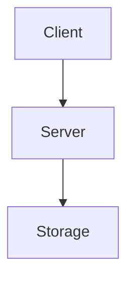

# Visualization Guidelines

Standards for creating clear, consistent visualizations in FerrisDB documentation.

**Purpose**: Define standards for creating ASCII diagrams and tables that enhance understanding of complex concepts.  
**Prerequisites**: Basic understanding of markdown and ASCII art

## Purpose

Visual representations help readers understand complex concepts quickly. We use ASCII diagrams and tables as our primary visualization tools because they:

- Work in all text environments (code comments, markdown, terminals)
- Version control tracks changes clearly
- Don't require external tools to view or edit
- Load instantly without dependencies

## ASCII vs Mermaid Usage

### ASCII Diagrams (Technical Guidelines)

- **Location**: All technical guidelines (`/guidelines/technical/`)
- **Purpose**: Source of truth for all architectural decisions
- **Usage**: Code comments, technical docs, terminal output
- **Authority**: All other diagrams must match these

### Mermaid Diagrams (Website Content)

- **Location**: Blog posts, articles, website documentation
- **Purpose**: Better visual presentation for web readers
- **Usage**: Jekyll-rendered content with Mermaid.js support
- **Rule**: MUST be based on corresponding ASCII diagram

### Conversion Example

ASCII (in guidelines):

```
┌─────────┐     ┌─────────┐
│ Client  │────▶│ Server  │
└─────────┘     └────┬────┘
                     │
                ┌────▼────┐
                │ Storage │
                └─────────┘
```

Mermaid (on website):



**Key Rule**: Update ASCII first, then update Mermaid to match

## ASCII Diagram Standards

### Box Drawing Characters

Use Unicode box-drawing characters for clean, professional diagrams:

```
┌─┬─┐  ╔═╦═╗  ╭─╮
│ │ │  ║ ║ ║  │ │
├─┼─┤  ╠═╬═╣  ╰─╯
└─┴─┘  ╚═╩═╝
```

### Common Patterns

#### Component Boxes

```
┌─────────────────┐
│    Component    │
│      Name       │
└─────────────────┘
```

#### Arrows and Connections

```
──────▶  Arrow right
◀──────  Arrow left
───┬───  Branch down
   │
───┴───  Merge up
   │
───┼───  Cross
```

#### Data Flow

```
┌──────┐      ┌──────┐      ┌──────┐
│ Read │─────▶│Process│─────▶│Write │
└──────┘      └──────┘      └──────┘
```

### Diagram Types

#### 1. Architecture Diagrams

Show system components and their relationships:

```
┌─────────────────┐     ┌─────────────────┐
│ Client Library  │     │ Client Library  │
└────────┬────────┘     └────────┬────────┘
         │                       │
         └───────────┬───────────┘
                     │
            ┌────────▼────────┐
            │  Server (gRPC)  │
            └────────┬────────┘
                     │
            ┌────────▼────────┐
            │ Storage Engine  │
            │   (LSM-tree)    │
            └────────┬────────┘
                     │
          ┌──────────┼──────────┐
          │          │          │
     ┌────▼────┐ ┌───▼────┐ ┌───▼────┐
     │MemTable │ │SSTables│ │  WAL   │
     └─────────┘ └────────┘ └────────┘
```

#### 2. State Diagrams

Show state transitions and conditions:

```
    ┌─────────┐
    │  Start  │
    └────┬────┘
         │ init()
    ┌────▼────┐
    │  Idle   │◀─────────┐
    └────┬────┘          │
         │ write()       │ commit()
    ┌────▼────┐     ┌────┴────┐
    │ Active  │────▶│Flushing │
    └────┬────┘     └─────────┘
         │ error()
    ┌────▼────┐
    │  Error  │
    └─────────┘
```

#### 3. Sequence Diagrams

Show interactions over time:

```
Client          Server          Storage
  │                │                │
  │    Request     │                │
  ├───────────────▶│                │
  │                │     Write      │
  │                ├───────────────▶│
  │                │                │
  │                │  Confirmation  │
  │                │◀───────────────┤
  │   Response     │                │
  │◀───────────────┤                │
  │                │                │
```

#### 4. Flow Charts

Show decision processes:

```
     ┌─────────┐
     │  Start  │
     └────┬────┘
          │
     ┌────▼────┐
     │ Check   │
     │ Cache   │
     └────┬────┘
          │
       ┌──┴──┐
       │Hit? │
       └─┬─┬─┘
     Yes │ │ No
         │ │
    ┌────▼─┴────┐
    │   Return  │
    │   Cached  │
    └───────────┘
         │
    ┌────▼────┐
    │  Query  │
    │Database │
    └────┬────┘
         │
    ┌────▼────┐
    │  Cache  │
    │ Result  │
    └────┬────┘
         │
    ┌────▼────┐
    │ Return  │
    └─────────┘
```

## Table Standards

### Basic Tables

Use markdown tables for structured data:

| Operation | Time Complexity | Space Complexity |
| --------- | --------------- | ---------------- |
| Insert    | O(log n)        | O(1)             |
| Search    | O(log n)        | O(1)             |
| Delete    | O(log n)        | O(1)             |

### Comparison Tables

Clearly show trade-offs:

| Storage Engine | Write Speed | Read Speed | Space Efficiency | Use Case    |
| -------------- | ----------- | ---------- | ---------------- | ----------- |
| B-Tree         | Moderate    | Fast       | Good             | General     |
| LSM-Tree       | Fast        | Moderate   | Moderate         | Write-heavy |
| Hash Table     | Fast        | Fast       | Poor             | Cache       |

### Configuration Tables

Document options clearly:

| Parameter       | Type  | Default | Description                        | Example                 |
| --------------- | ----- | ------- | ---------------------------------- | ----------------------- |
| `memtable_size` | usize | 64MB    | Maximum memtable size before flush | `128 * 1024 * 1024`     |
| `wal_sync`      | bool  | true    | Sync WAL on every write            | `false`                 |
| `compression`   | enum  | Snappy  | Compression algorithm              | `CompressionType::Zstd` |

## Implementation Status Markers

### In Documentation

Always clearly mark speculative or planned content:

```
## Current Implementation

The storage engine uses a simple skip list for the memtable.

## [PLANNED] Future Implementation

We plan to add a concurrent skip list with lock-free operations:

┌─────────────┐
│  Skip List  │ [PLANNED]
│ (Lock-free) │
└─────────────┘
```

### In Diagrams

Mark planned components clearly:

```
┌─────────────┐     ┌─────────────┐
│ Implemented │────▶│  [PLANNED]  │
│  Component  │     │  Component  │
└─────────────┘     └─────────────┘
```

## Best Practices

### 1. Consistency

- Use the same symbols throughout a document
- Maintain consistent spacing and alignment
- Follow established patterns from existing diagrams

### 2. Simplicity

- Show only essential information
- Break complex diagrams into multiple simpler ones
- Use clear, descriptive labels

### 3. Maintenance

- Update diagrams when implementation changes
- Remove [PLANNED] markers when features are implemented
- Keep diagrams close to the code they document

### 4. Accessibility

- Add text descriptions for complex diagrams
- Ensure diagrams make sense without color
- Test readability in different environments

## Tools

While we prefer hand-crafted ASCII art, these tools can help:

- **monodraw** (macOS) - ASCII diagram editor
- **asciiflow.com** - Web-based ASCII drawing
- **graph-easy** - Convert between diagram formats
- **ditaa** - Convert ASCII diagrams to images

## Examples from FerrisDB

### SSTable Format

```
┌─────────────┐
│   Header    │ - Magic number, version
├─────────────┤
│ Data Blocks │ - Key-value pairs
├─────────────┤
│ Index Block │ - Block offsets
├─────────────┤
│Bloom Filter │ - Optional
├─────────────┤
│   Footer    │ - Metadata, checksums
└─────────────┘
```

### Write Path Flow

```
   Client
     │
     ▼
   Write
     │
     ├─────────────┐
     ▼             ▼
    WAL        MemTable
     │             │
     │             ▼
     │         Is Full?
     │             │
     │         Yes │ No
     │             ▼
     │          Flush
     │             │
     ▼             ▼
  Success      SSTable
```

## Review Checklist

When reviewing documentation with visualizations:

- [ ] Diagrams are clear and easy to understand
- [ ] ASCII art is properly aligned
- [ ] Tables have consistent formatting
- [ ] Planned features are clearly marked
- [ ] Diagrams match the actual implementation
- [ ] Complex diagrams have explanatory text
- [ ] Symbols are used consistently

## Related Guidelines

- [Documentation](documentation.md) - Where visualizations are used
- [Markdown Standards](markdown-standards.md) - Formatting diagrams
- [Website Design](../content/website-design.md) - Mermaid diagrams for web
- [Architecture](../technical/architecture.md) - System diagrams
